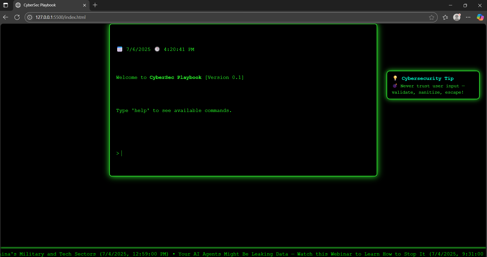

# 🧑‍💻 CyberSec Playbook — Interactive Cybersecurity Portfolio

Welcome to **CyberSec Playbook** — an interactive, hacker-themed cybersecurity portfolio designed to showcase my skills, experience, and passion for security. This project simulates a terminal interface with real-time features to engage recruiters, hiring managers, and cybersecurity enthusiasts.

---

## ⚙️ Features

- 💻 Terminal-style command input (`help`, `skills`, `projects`, `resume`, etc.)
- 🔐 Rotating **cybersecurity tips** panel (floating right-side box)
- 🧪 Fake **threat simulation feed** (future enhancement ready)
- 📡 Live scrolling **cybersecurity news ticker**
- 🕒 Dynamic real-time **clock** and user input system
- 📄 Integrated **resume page** with downloadable PDF and contact links
- 🌐 Fully responsive + deployable on [GitHub Pages](https://abett07.github.io/cybersec-playbook)

---

## 🔗 Live Demo

**▶ [Launch CyberSec Playbook](https://abett07.github.io/cybersec-playbook)**

---

## 🧑‍💼 About Me

I’m **Abett Reddy Cheruku**, a cybersecurity graduate student passionate about offensive and defensive security, real-world threat hunting, and building tools that simulate adversarial behavior. This portfolio reflects not only my technical skills but also my creativity and passion for the field.

---

## 🤝 Acknowledgments

Built from scratch with HTML, CSS, and JavaScript.  
Special thanks to [ChatGPT by OpenAI](https://chat.openai.com/) for creative guidance and feature implementation ideas.

---

## 📬 Contact

- ✉️ [abettreddycheruku@gmail.com](mailto:abettreddycheruku@gmail.com)
- 🔗 [LinkedIn](https://www.linkedin.com/in/abett-reddy-cheruku/)
- 🐙 [GitHub](https://github.com/abett07)
